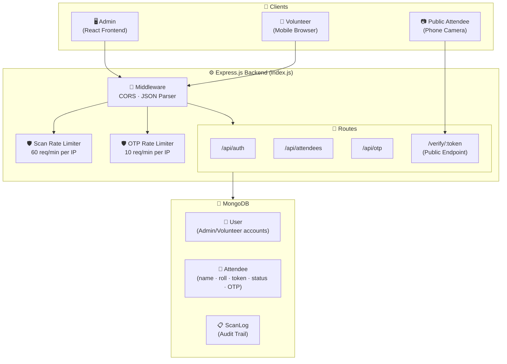
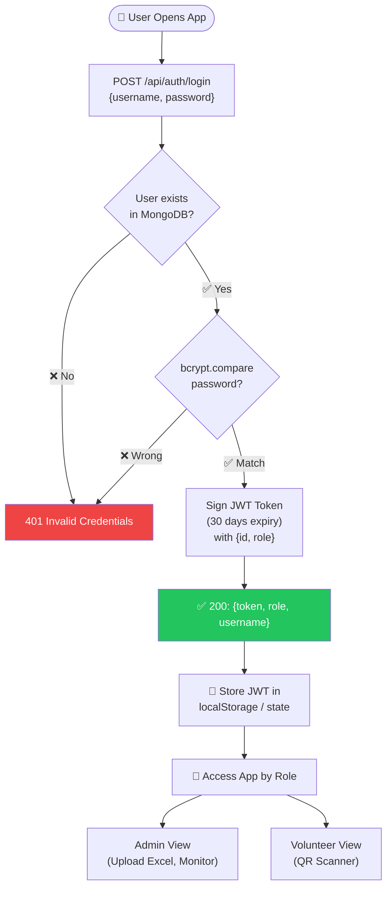
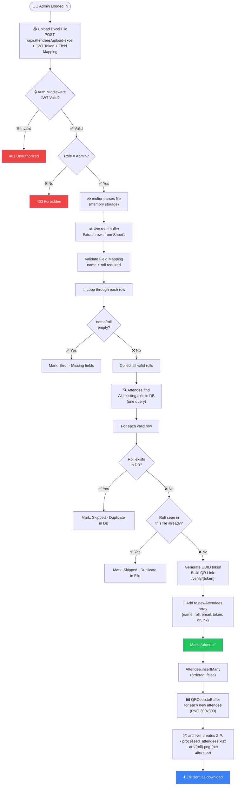
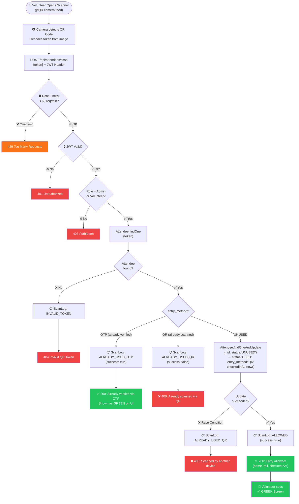
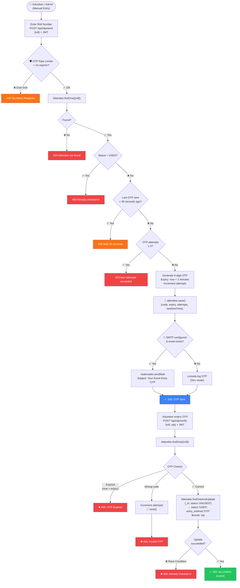
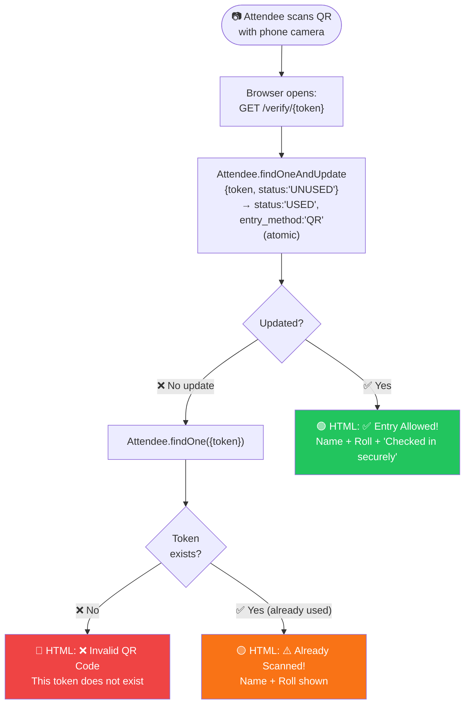
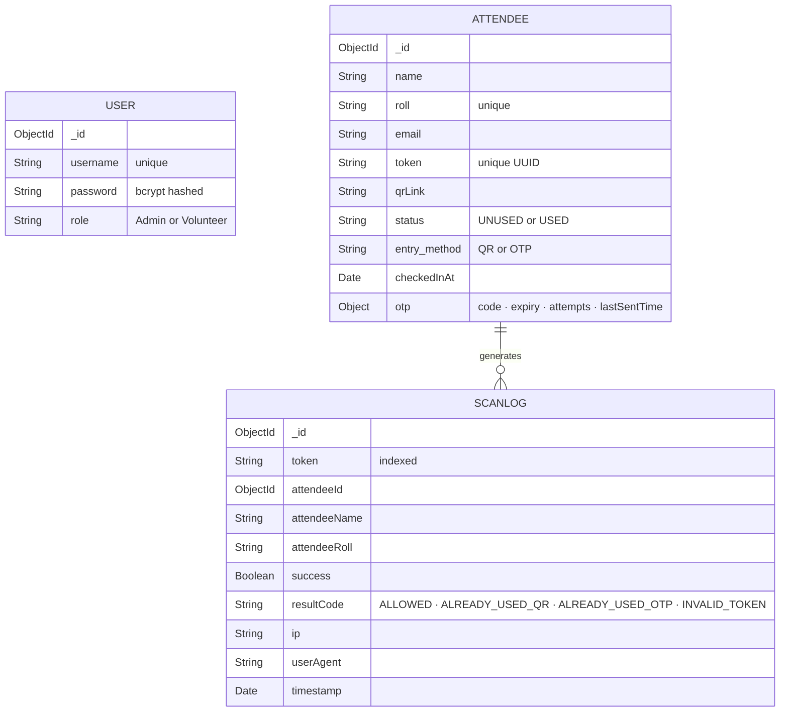
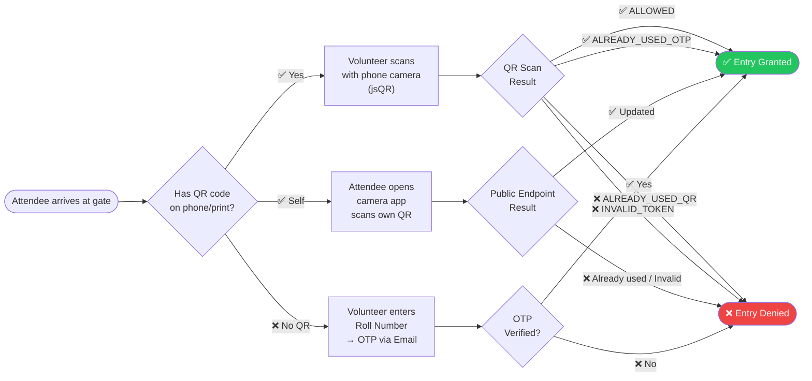

# 🎟️ QR Event Entry System — Complete Flow Diagram

## 🏗️ System Architecture Overview

---

## 1️⃣ Authentication Flow

---

## 2️⃣ Admin — Excel Upload & QR Generation Flow

---

## 3️⃣ Volunteer — QR Scan Flow

---

## 4️⃣ OTP Manual Entry Flow (Fallback)

---

## 5️⃣ Public Self-Scan Flow (Phone Camera → Browser)

---

## 🗄️ Database Models Summary

---

## 🛡️ Security Layer Summary

| Layer | Mechanism | Limit |
|-------|-----------|-------|
| **Authentication** | JWT (30-day expiry) | All protected routes |
| **Authorization** | Role-based (Admin / Volunteer) | Per-route `authorize()` |
| **Scan Rate Limit** | express-rate-limit per IP | 60 req/min |
| **OTP Rate Limit** | express-rate-limit per IP | 10 req/min |
| **OTP Cooldown** | 30s between resends | Per attendee |
| **OTP Max Attempts** | Hard block after 3 tries | Per attendee |
| **Double Scan Prevention** | MongoDB atomic `findOneAndUpdate` | Race condition safe |
| **Audit Trail** | ScanLog every attempt | Success + Failure |

---

## 🔄 Entry Method Decision Tree

